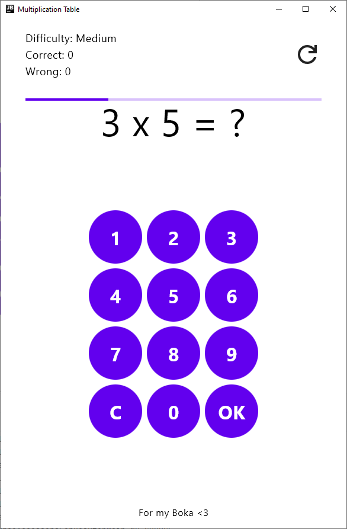

This project is a Kotlin Multiplatform application designed to target multiple platforms, including Android, iOS, Web, and Desktop. The application serves as a straightforward multiplication table tool aimed at facilitating the learning of multiplication for numbers ranging from 1 to 10. It features three distinct difficulty settings and includes functionality for tracking user scores.

## Getting Started
To build and run the project, follow these steps:
1. Clone the repository.
2. Open the project in Android Studio or your preferred IDE.
3. Build the project and run the application on your desired platform using green play button in your IDE. If that does not work, you can use `./gradlew run` gradle task to to run the project, or use gradle task list `Tasks->compose desktop->run`.

## Contributing
If you would like to contribute to the project, either create the pull request, or contact me in the issues section. If you decide to create pull request, please make sure to follow MVVM principles.
**Contact** me by opening an issue before spending a lots of time on big PR's just to make sure we are on the same page for the big new feature.

## License
This project is licensed under the [Apache-2.0 license](LICENSE).

## Contact
For any questions or support, please contact me using issues in this repository.
